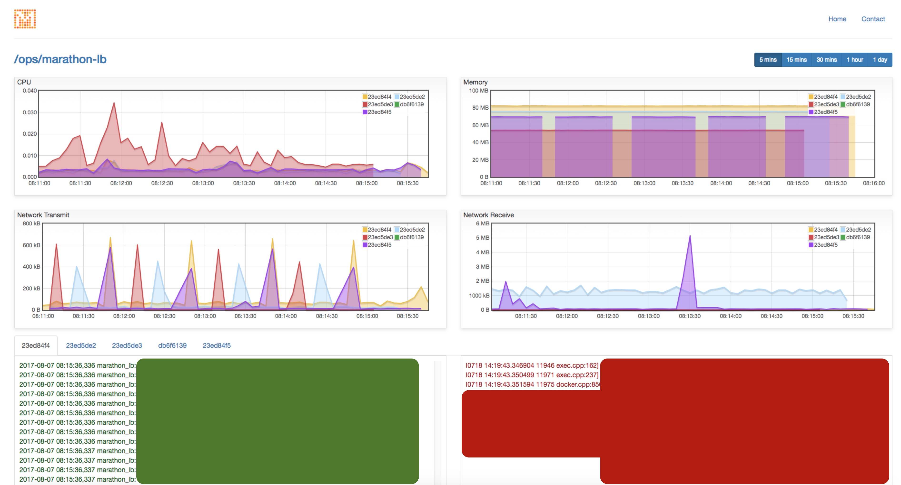

<p align="center">
  
</p>
M.A.D (Mesos Application Dashboard) is a dashboard which shows CPU / Memory / Network usage and STDOUT / STDERR for a mesos application.

## How to setup

```
$ git clone https://github.com/Factual/mad.git
$ cd mad
$ cp docker.env.example docker.env
# edit docker.env file to fill the parameters
$ docker-compose up
```

## How to use

Access http://localhost:3000 (this is the default port when you launch the docker container). Fill the application id and hit go. You will see the dashboard.


